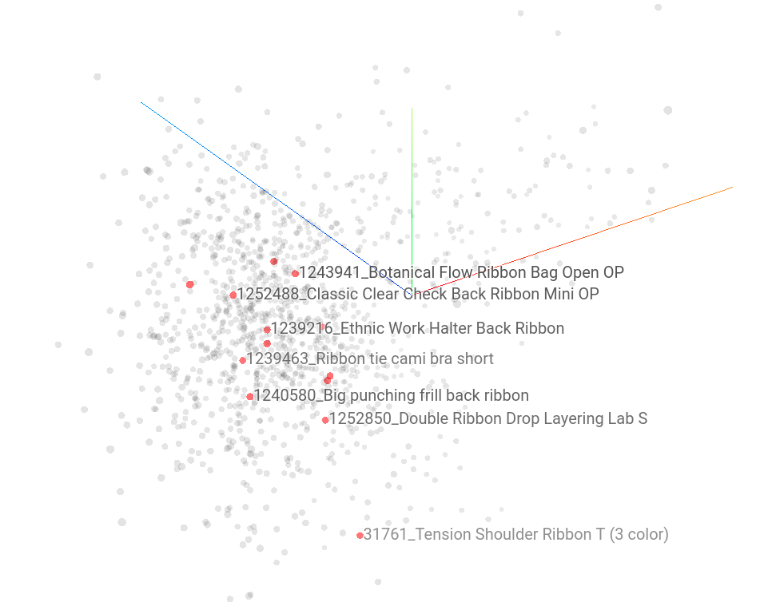

# ssho-reco-api  :bar_chart:
>스와이프 쇼핑몰 '스쇼' Data & AI Unit\
서강대학교 경영학/빅데이터사이언스(데이터분석) 전공 이예은

### 01. item 기반 추천을 위한 feature extraction
Auto-Encoder기법을 활용한 이미지 대표 벡터 추출, tensorflow.keras
- Encoder 부분을 일부 활용하여 상품 이미지간 비교에 활용.
[issue and result](https://github.com/ssho-lab/ssho-issue-board/issues/40#issuecomment-759288144)
#### + title embed
- feature extraction을 위해 상품 타이틀 정보 이용을 위한 trial
- 상품명에 대해 이중 translation을 통해 전처리, 색상/사이즈 등의 추가 정보 제외
- lemmatize
- gensim, doc2vec 활용
> 국내 쇼핑몰의 줄임말, 신조어 등 사용으로 정상적인 전처리가 어려웠음.

 

### 02. Matrix Factorization 기반 가중치 생성
희박할 수 있는 상품에 대한 추천이 아닌 특정 쇼핑몰에 대한 유저의 취향을 비교하는 데에 사용
- 유저의 스와이프 기록 -> 특정 쇼핑몰에 대한 유저의 취향 기록
- 전체 유저의 기록을 기반으로 타 쇼핑몰에 대한 유저의 선호도 예측
- 신규 카드셋 생성에 쇼핑몰 가중
